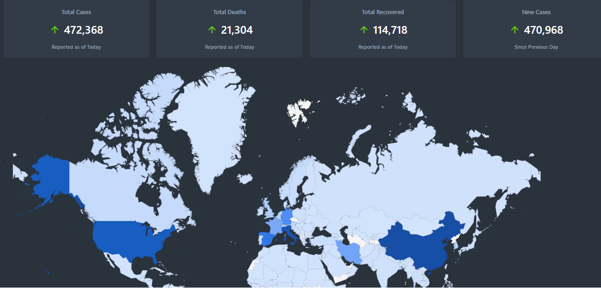

# trackCorona
it is Coronavirus tracker for web with chart.

## Features
* __Live data__: Shows the most recent data, and updates automatically.
* __GeoChart__:
   * __Current state chart__ for all countries.
* __Search__ for countries.
* __Statistics__: Including the number of confirmed, recovered, and deaths, in addition to percents.

## Author
dev fz_md